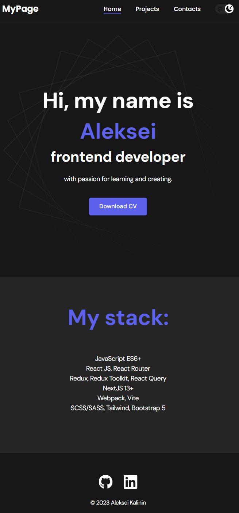
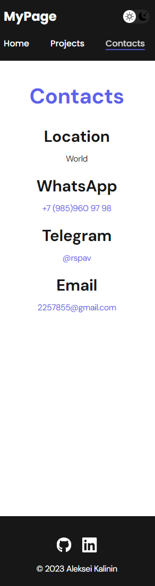

Привет, меня зовут Алексей, и я фронтенд-разработчик с горячей страстью к обучению и созданию.

Мой стек:

JavaScript ES6+
React JS, React Router
Redux, Redux Toolkit, React Query
NextJS 13+
Webpack, Vite
SCSS/SASS, Tailwind, Bootstrap 5

Я постоянно совершенствую свои навыки и стараюсь быть в курсе последних тенденций в мире фронтенд-разработки. Моей целью является создание качественных и современных веб-приложений, которые приносят пользу пользователям. Если у вас есть интересные проекты или сотрудничества, не стесняйтесь связаться со мной.

> [Telegram](https://t.me/rspav)
> [Whatsapp](https://wa.me/+79859609798)
> [LinkedIn](https://www.linkedin.com/feed/)
> [Phone +79859609798](tel:+79859609798)
> [email 2257855@gmail.com](mailto: 2257855@gmail.com)

Hello, my name is Aleksei, and I am a frontend developer with a strong passion for learning and creating.

My Tech Stack:

JavaScript ES6+
React JS, React Router
Redux, Redux Toolkit, React Query
NextJS 13+
Webpack, Vite
SCSS/SASS, Tailwind, Bootstrap 5

I am constantly improving my skills and staying up-to-date with the latest trends in the world of frontend development. My goal is to create high-quality and modern web applications that provide value to users. If you have interesting projects or collaboration opportunities, feel free to reach out to me.

> [Telegram](https://t.me/rspav)
> [Whatsapp](https://wa.me/+79859609798)
> [LinkedIn](https://www.linkedin.com/feed/)
> [Phone +79859609798](tel:+79859609798)
> [email 2257855@gmail.com](mailto: 2257855@gmail.com)

